# Vis-Data-Density-Map

This repository implements naive density map to visualize high-dimension data.

This repository includes:

+ Dimension reduction of high-dimension data
+ Common kernel functions
+ Density map generation by kernel estimation
+ Visualization of density map


## Dimension Reduction

We use common dimension reduction method, i.e., TSNE. However, when dimension grows larger, TSNE is much slower and does not work well. Therefore, we first use PCA to reduce dimension to 100, then use TSNE to reduce dimension to 2.


## Density Map from Kernel Density

For efficiency issue, we divide 2-D Euclidean space into $M\times N$ grids and count number of points in each grid by class. For $C$ classes, there should be $C$ counting results which are called grid maps. Then we do kernel density estimation on those  $C$ grid maps. We notice that KDE can be implemented by convolution operation on the grid maps.

Kernel function is used in kernel density estimation. We implement some common kernel functions:

+ Uniform: $K(x)=\frac{1}{2w}I(|x|<w)$
+ Triangular: $K(x)=\frac{w-|x|}{w^2}I(|x|<w)$
+ Gaussian: $K(x)=\frac{1}{2\pi}e^{-\frac{x^2}{2w^2}}$

A 2-D kernel function can be calculated by multiply 1-D kernel functions of x and y dimensions:
$$
K_2(x,y)=K_1(x)K_1(y)
$$
In our implementation, we limit the range of Gaussian density estimation by using a Gaussian kernel. All kernel size should be odd number.


## Density Map Visualization

For $C$ classes and grid map of $M\times N$, we visualize it on a $M\times N$ image where each pixel represent a grid. 

Numbers of points in each class may vary greatly. To balance between classes, we first normalize grid maps by class so that maximum value is 1 and minimum value is 0 in each class:
$$
\text{GridMap}^c[i,j]=\frac{\text{OriginalGridMap}^c[i,j]-\text{min_value}^c}{\text{max_value}^c-\text{min_value}^c}
$$
where
$$
\text{max_value}^c=\max_{1\le i\le M,1\le j\le N}\text{OriginalGridMap}^c[i,j],\\ \text{min_value}^c=\min_{1\le i\le M,1\le j\le N}\text{OriginalGridMap}^c[i,j]
$$
To represent density of points, we define saturation value of each pixel according to total density of the corresponding grid:
$$
S[i,j]=\frac{1}{U}\sum_{c=1}^C\text{GridMap}^c[i,j]
$$
where $U$ is used to ensure that all saturation value is valid:
$$
U=\max_{1\le i\le M,1\le j\le N}{\sum_{c=1}^C\text{GridMap}^c[i,j]}
$$
To show distribution of each class, we use per-pixel color interpolation in HSV color space. For each of the $C$ classes, we assign a specific Hue value. Then we calculate hue value of each pixel as weighted sum of all class hue values:
$$
H[i,j]=\frac{\sum_{c=1}^C\text{GridMap}^c[i,j]*\text{ClassHue}[c]}{\sum_{c=1}^C\text{GridMap}^c[i,j]}
$$
We set value of V to 1 for all pixels.


## Get Started

Example data of 1000 MNIST images has been put in `./data` . 

First, create a Python 3.x environment and install following Python packages:

+ matplotlib
+ numpy
+ opencv-python
+ scipy
+ sklearn

You can install by this shell command:

```shell
pip3 install -r requirements.txt
```

To do dimension reduction, execute:

```shell
python dimension_reduction.py
```

TSNE results are saved into `./tsne` folder. 

To visualize density map, execute:

```shell
python density_map.py
```

Density maps are saved into `./result` folder. 


## Experiment Results

### Dimension Reduction

#### Experiment 1: Perplexity & Iteration of TSNE

| iter | perplexity=10                                   | perplexity=30                                   | perplexity=50                                    |
| ---- | ----------------------------------------------- | ----------------------------------------------- | ------------------------------------------------ |
| 250  | 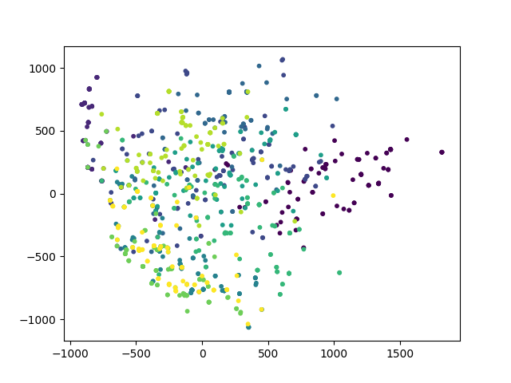 | 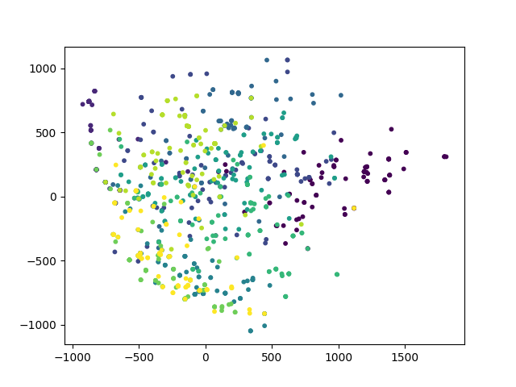   | 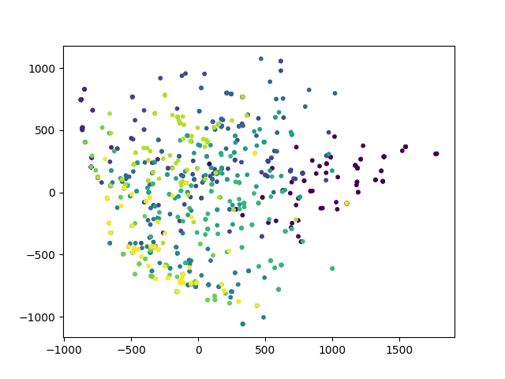 |
| 500  | 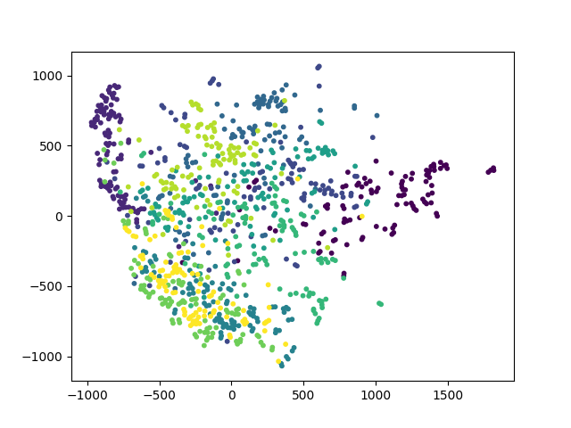 | 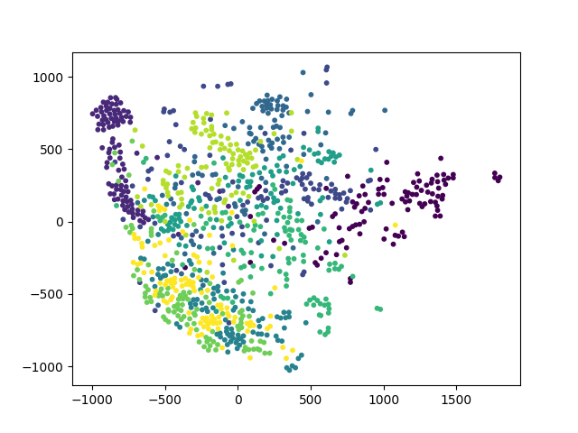 | 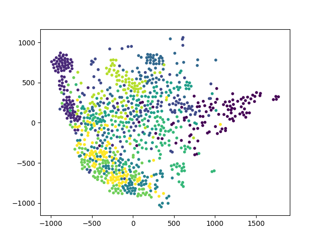 |
| 1000 | 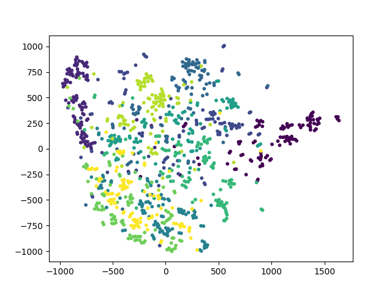 | 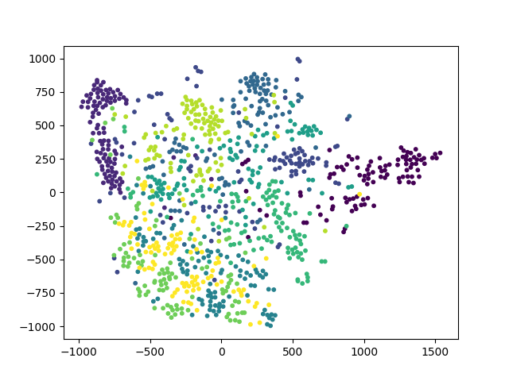 | 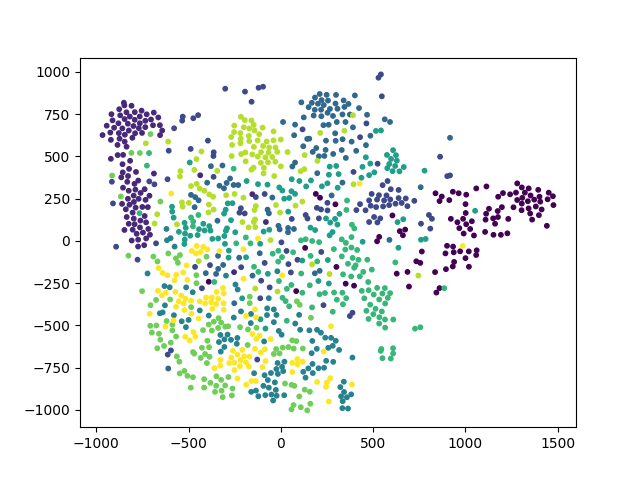 |
| 2000 | 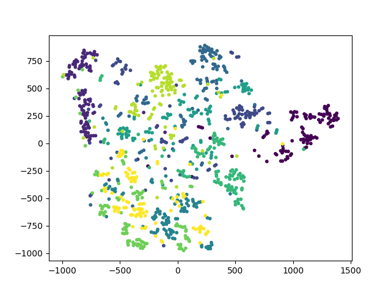 | 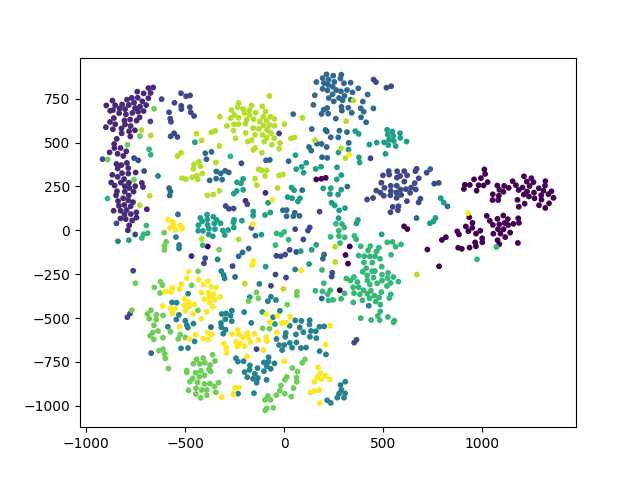 | 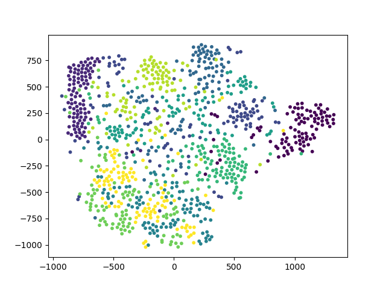 |
| 3500 | 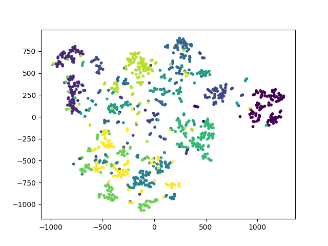 | 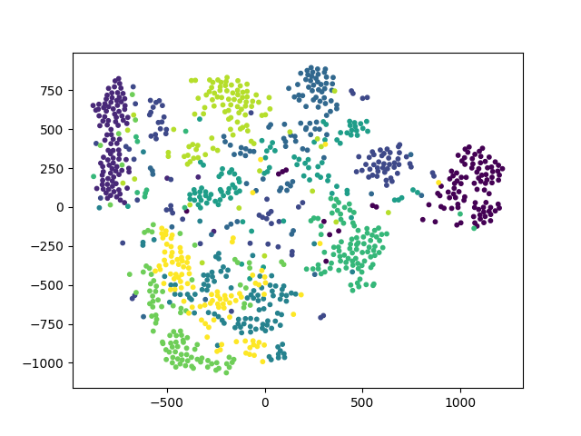 | 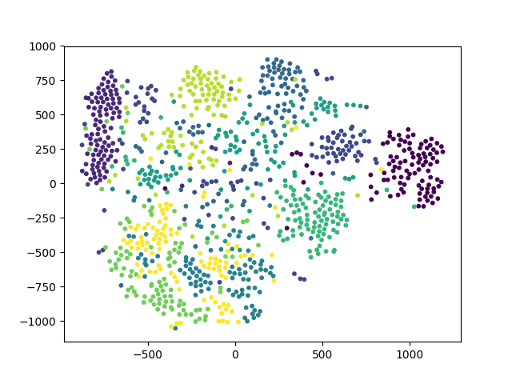 |
| 5000 | 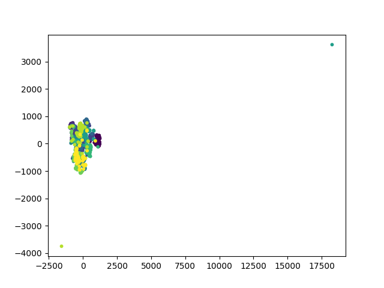 | 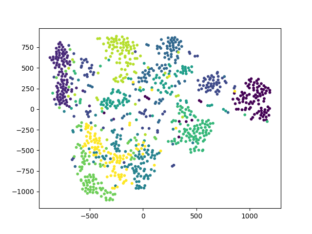 | 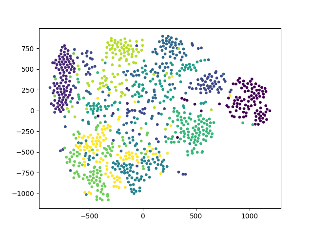 |

Above results indicate that:

+ perplexity=10 is not suitable, perplexity=50 works well.
+ number of iterations should be larger than 2000.

#### Experiment 2: PCA Preprocessing

We fix perplexity to 30 and 50 respectively.

Perplexity=30:

| Iter | No PCA | PCA (dim=100) | PCA (dim=50) |
| ---- | ------ | ------------- | ------------ |
| 2000 |  | 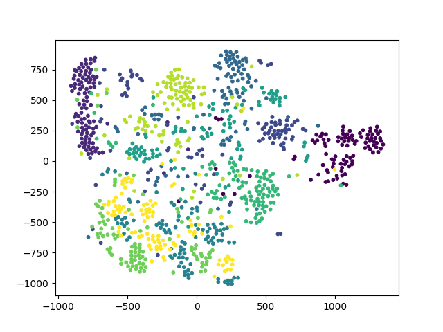 | 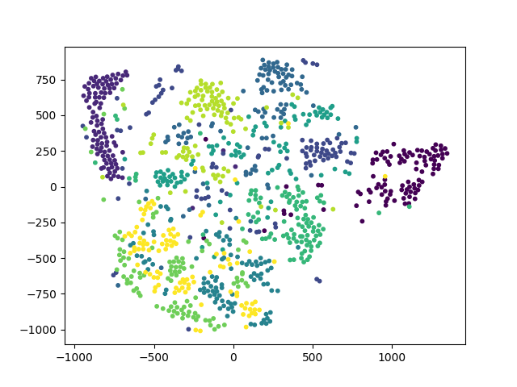 |
| 3500 |  | 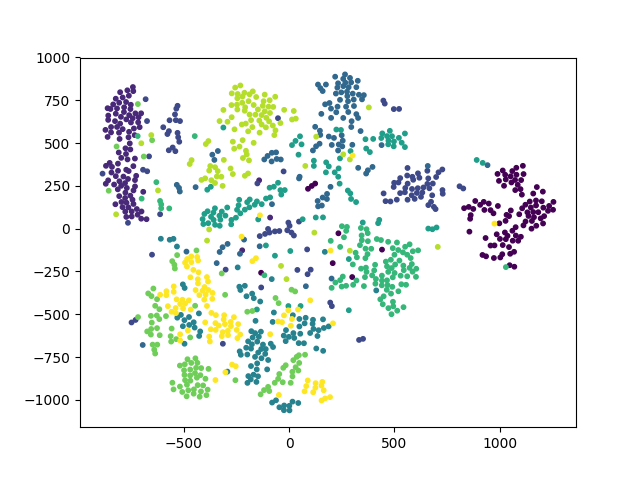 | 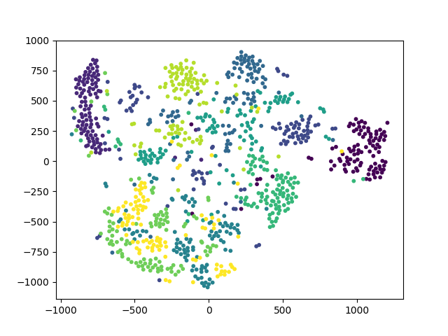 |
| 5000 |  | 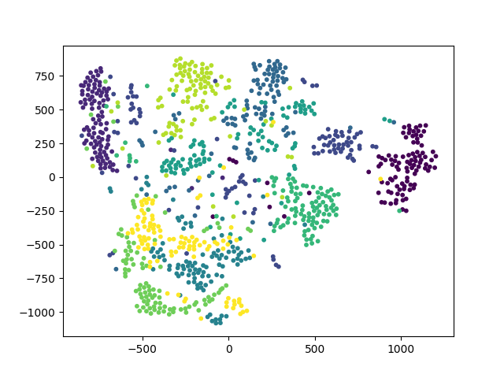 | 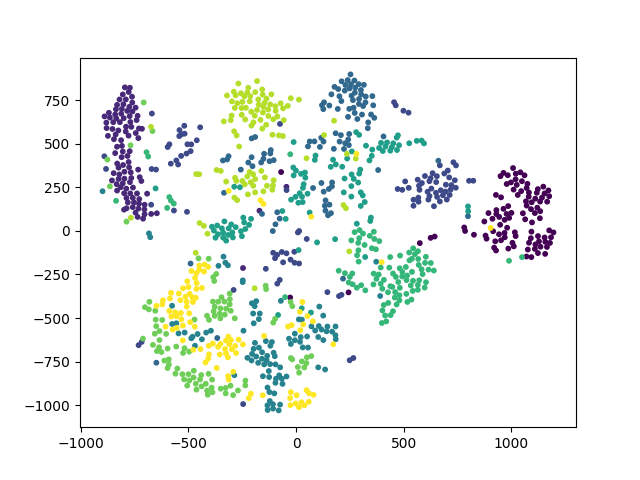 |

Perplexity=50:

| Iter | No PCA | PCA (dim=100) | PCA (dim=50) |
| ---- | ------ | ------------- | ------------ |
| 2000 |  | 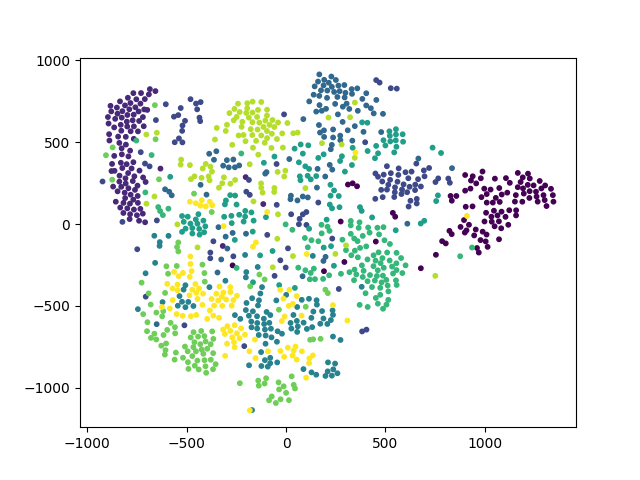 | 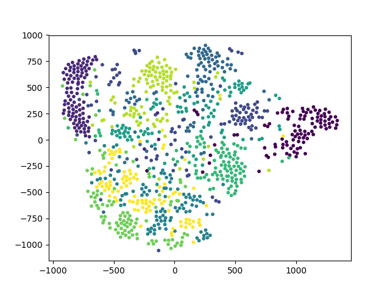 |
| 3500 |  | 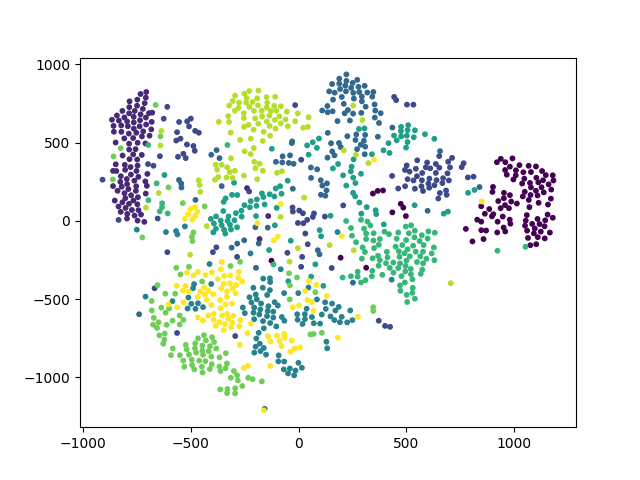 | 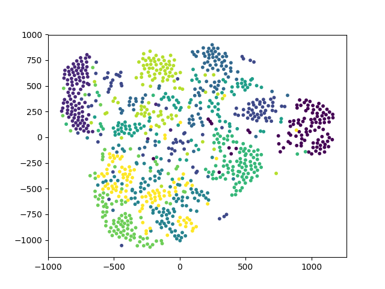 |
| 5000 |  | 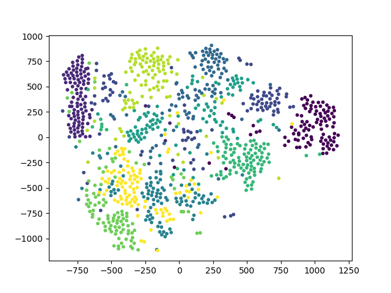 | 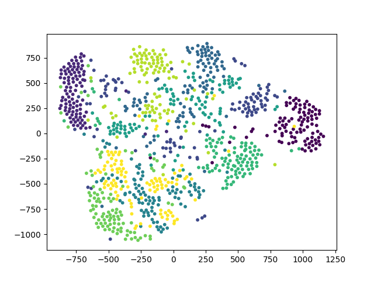 |

It indicates that PCA preprocessing slightly help separate points of different classes. 

We compare efficiency of different methods (in second, perplexity=50):

<table>
    <tr>
        <td rowspan="2">iter</td>
        <td>TSNE</td>
        <td colspan="3">PCA (dim=100)</td>
        <td colspan="3">PCA (dim=50)</td>
    </tr>
    <tr>
        <td>Total</td>
        <td>PCA</td>
        <td>TSNE</td>
        <td>Total</td>
        <td>PCA</td>
        <td>TSNE</td>
        <td>Total</td>
    </tr>
    <tr>
        <td>2000</td>
        <td>10.05</td>
        <td rowspan="3">0.93</td>
        <td>8.98</td>
        <td>9.91</td>
        <td rowspan="3">0.61</td>
        <td>8.93</td>
        <td>9.54</td>
    </tr>
    <tr>
        <td>3500</td>
        <td>16.00</td>
        <td>14.88</td>
        <td>15.81</td>
        <td>14.77</td>
        <td>15.38</td>
    </tr>
    <tr>
        <td>5000</td>
        <td>21.76</td>
        <td>20.65</td>
        <td>21.58</td>
        <td>20.57</td>
        <td>21.18</td>
    </tr>
</table>

It indicates that PCA preprocessing is a litter bit faster than pure TSNE method.


### Density Map Visualization

#### Comparison of Kernel Functions

We set $H=W=200$ and compare visualization results from different kernel functions:

| kernel size | Uniform                                                      | Gaussian                                                     | Triangular                                                   |
| ----------- | ------------------------------------------------------------ | ------------------------------------------------------------ | ------------------------------------------------------------ |
| 7           | 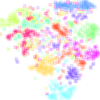 |  | 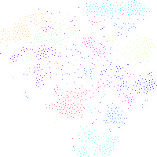 |
| 17          | 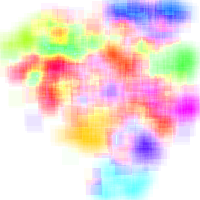 |  | 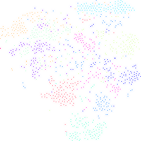 |
| 27          | 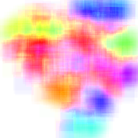 | 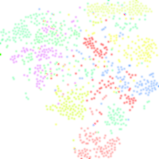 | 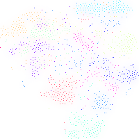 |

It indicates that uniform kernel produces smoothest density map, while triangular kernel produces sharpest density map.

#### Influence of Sampling Resolution and Kernel Size

We use uniform kernel:

| kernel size | $50\times 50$ | $100\times 100$ | $200\times 200$                                  |
| ----------- | ------------------------------------------------------------ | ------------------------------------------------------------ | ------------------------------------------------------------ |
| 7           | 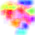 | 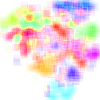 |  |
| 17          |  | 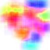 |  |
| 27          | 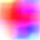 | 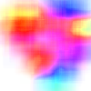 |  |

It indicates that using smaller $H$ and $W$ (larger grid size) makes density maps smoother. Moreover, with different $H$ and $W$, suitable kernel size is also changing. Generally, when $H$ and $W$ becomes larger, the suitable kernel size becomes larger and vice versa.


## Reference

Maaten, Laurens van der, and Geoffrey Hinton. "Visualizing data using t-SNE." *Journal of machine learning research* 9.Nov (2008): 2579-2605.

